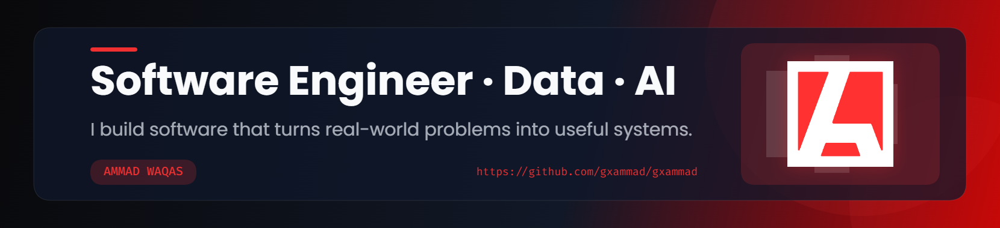

  

  

### Software Engineer · Data · AI

**I build software that turns real-world problems into useful systems.**

`Next.js` · `Python` · `SQL` · `PostgreSQL` · `Supabase` · `REST APIs` · `AI`

---

# `01` — ABOUT

I'm **Ammad Waqas**, a Software Engineer focused on building production-ready software, data systems, backend services, dashboards and AI-powered applications.

My work sits between:

SOFTWARE ENGINEERING
        ↓
DATA & AUTOMATION
        ↓
AI-POWERED SYSTEMS
I enjoy taking complex requirements, messy data and real-world workflows and turning them into systems that are reliable, understandable and useful.

Currently exploring deeper into backend engineering, data engineering and practical AI.

02 — WHAT I BUILD
<table> <tr> <td width="33%" valign="top">
⚡ SOFTWARE

Production web applications, backend services, APIs, authentication, business workflows and dashboards.

Focus

Next.js
React
Node.js
Python
REST APIs

</td> <td width="33%" valign="top">
📊 DATA

ETL pipelines, data processing, validation, reporting, analytics and large-scale data workflows.

Focus

Python
SQL
PostgreSQL
Pandas
SurveyCTO

</td> <td width="33%" valign="top">
🧠 AI

Practical AI applications, transcription, intelligent automation and AI-assisted software.

Focus

Python
Whisper
AI APIs
Automation

</td> </tr> </table>
03 — SELECTED WORK
🏢 DFLT Platform
Production Data & Analytics Platform

A production data platform developed for an EU-funded digital transformation project supported by GIZ.

Worked across:

Data acquisition through SurveyCTO
Python ETL pipelines
SQL-based data processing
Automated validation
Scheduled data synchronization
KPI dashboards
Reporting and monitoring
Backend APIs and scheduled jobs
Linux production deployment

Stack

Python SQL SurveyCTO REST APIs Linux Dashboard

→ Live Platform

🛒 Tech & Solutions
Production E-commerce Platform · UK

A production e-commerce platform built for a UK technology business.

Worked across:

Product and inventory workflows
Authentication
Role-based access
PostgreSQL data layer
Payment integration
Transactional email
Cloud object storage
Administrative workflows
Reporting

Stack

Next.js React Supabase PostgreSQL Stripe Cloudflare R2 Resend

→ Live Website

🎬 EaseYT
AI-Powered YouTube Processing Platform

A MERN application designed around YouTube transcription, translation, summarization and document generation.

Stack

MongoDB Express React Node.js Whisper Google APIs

→ Live
→ Source Code

👥 Hirewise
Recruitment Management Platform

A recruitment-focused application designed around candidates, recruiters and structured hiring workflows.

Stack

Next.js Supabase PostgreSQL Tailwind

→ Live
→ Source Code

🧭 Meridian
Modern Digital Application

A modern web application focused on structured digital workflows and a clean user experience.

Stack

Next.js React Supabase

→ Live
→ Source Code

🪪 SSPA Verification
CNIC / Beneficiary Verification Platform

A web application built around verification workflows and beneficiary-related data.

Stack

Next.js APIs Vercel

→ Live
→ Source Code

💻 Devcore
Modern Software Product

A modern web application focused on software/product presentation and digital workflows.

Stack

Next.js React Tailwind

→ Live
→ Source Code

🌊 Relief PK
Flood Relief Donation Platform

A web platform created around flood relief fundraising and donations.

→ Live
→ Source Code

04 — TECHNOLOGY

LANGUAGES

  

FRONTEND

  

BACKEND & DATA

  

CLOUD & DEVOPS
 

05 — ENGINEERING FOCUS
                    SOFTWARE
                       │
          ┌────────────┼────────────┐
          │            │            │
       Backend       Frontend      APIs
          │            │            │
          └────────────┼────────────┘
                       │
                     DATA
                       │
          ┌────────────┼────────────┐
          │            │            │
         ETL          SQL        Analytics
          │            │            │
          └────────────┼────────────┘
                       │
                       AI
                       │
              Automation & Tools
Core Areas

Backend Engineering

Data Engineering

Web Applications

ETL & Data Processing

REST APIs

Dashboards & Reporting

AI Integration

Automation

Cloud Deployment

06 — HOW I APPROACH PROBLEMS

I don't start with a framework.

I start with the problem.

┌──────────────┐
│    PROBLEM   │
└──────┬───────┘
       ↓
┌──────────────┐
│  UNDERSTAND  │
└──────┬───────┘
       ↓
┌──────────────┐
│    DESIGN    │
└──────┬───────┘
       ↓
┌──────────────┐
│     BUILD    │
└──────┬───────┘
       ↓
┌──────────────┐
│    MEASURE   │
└──────┬───────┘
       ↓
┌──────────────┐
│    IMPROVE   │
└──────────────┘

Build less noise. Build more value.

07 — EXPERIENCE
Software Engineer — Data & Analytics

SDPI · DFLT Project

Worked on production data infrastructure, ETL workflows, APIs, dashboards, validation, monitoring and reporting for a large-scale digital transformation project.

Python SQL SurveyCTO ETL REST APIs Linux

Full Stack Software Engineer

Tech & Solutions · UK

Worked on a production e-commerce platform covering authentication, authorization, database architecture, payments, cloud storage, email and administrative workflows.

Next.js React Supabase PostgreSQL Stripe Cloudflare R2

Data Analyst

ARCH Technologies

Worked on machine learning, predictive analytics, data processing and Python-based automation.

Python Machine Learning Data Analysis

08 — CURRENTLY
building:
  - A.PRO
  - production web applications
  - data-driven systems

exploring:
  - Backend Engineering
  - Data Engineering
  - AI-assisted development
  - Intelligent automation

working_with:
  - Next.js
  - Python
  - PostgreSQL
  - Supabase
  - REST APIs
  - Cloud Platforms

interested_in:
  - Software Engineering
  - Backend Engineering
  - Data Engineering
  - AI
  - Real-world technical problems
09 — EDUCATION
BS Software Engineering

University of Gujrat

2021 — 2025

10 — CREDENTIALS

   

11 — CONNECT

      

  
HAVE A PROBLEM WORTH SOLVING?
LET'S BUILD SOMETHING USEFUL.
  

  

A.PRO — Ammad Professional

Software Engineering · Data · AI

  

 
